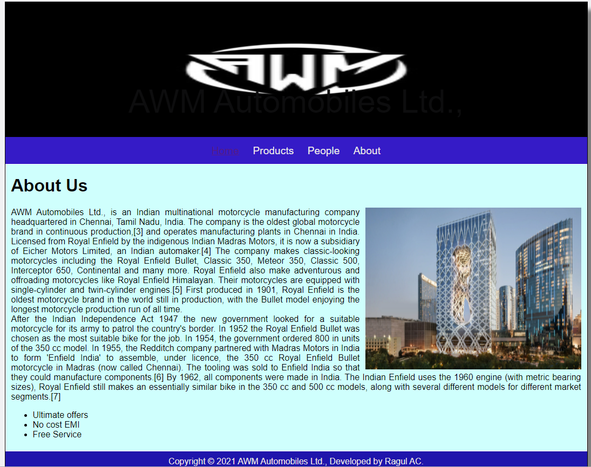
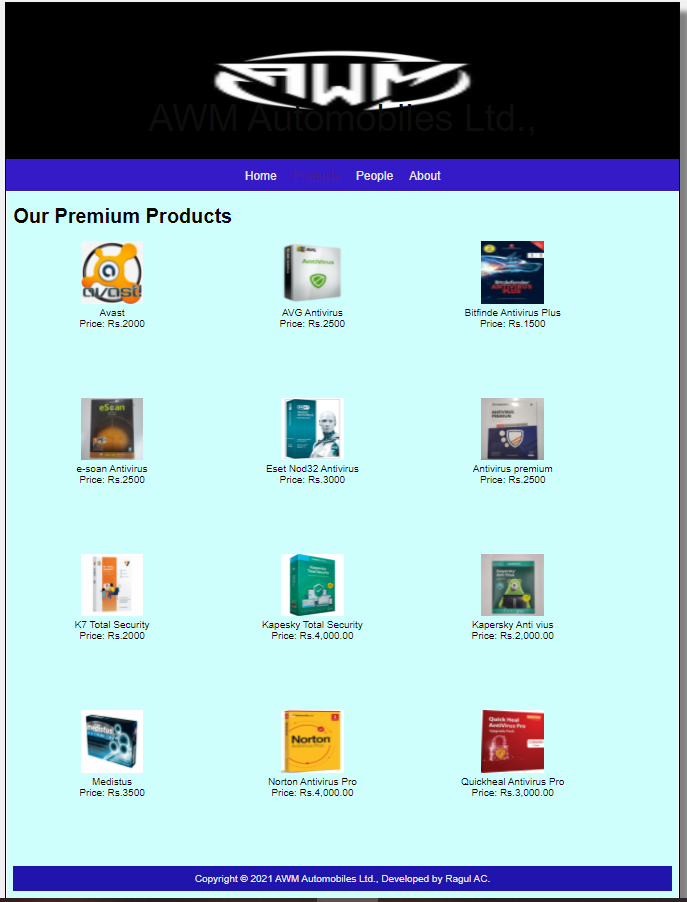
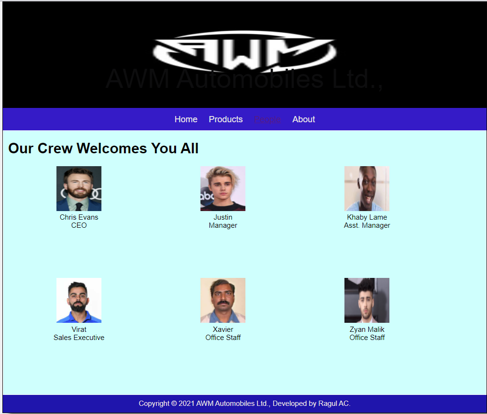
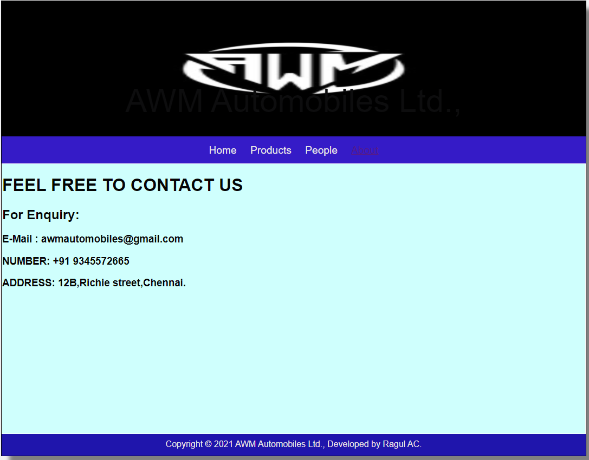

# Web Design for a Software Product Company

## AIM:

To design a static website for a software product company company.

## DESIGN STEPS:

### Step 1:

Requirement collection.

### Step 2:

Creating the layout using HTML and CSS.

### Step 3:

Updating the sample content.

### Step 4:

Choose the appropriate style and color scheme.

### Step 5:

Validate the layout in various browsers.

### Step 6:

Validate the HTML code.

### Step 6:

Publish the website in the given URL.

## PROGRAM :

### Layout.css
~~~
* {
  box-sizing: border-box;
  font-family: Arial, Helvetica, sans-serif;
}
body {
  background-color: #f1f1f3;
  color: #050505;
}
.container {
  width: 1080px;
  margin-left: auto;
  margin-right: auto;
  border-width: 1px 1px 1px 1px;
  border-style: solid;
  box-shadow: 15px 15px 8px gray;
}

.banner {
  display: block;
  width: 100%;
  height: 250px;
  text-align: center;
  font-size: 60px;
  background-image: url("/static/img/logo.jpg");
  background-size: 100% 100%;
  margin: 0px 0px 0px 0px;
  padding-top: 150px;
  color: #0d0d0e;
}

.menu {
  display: block;
  width: 100%;
  height: 50px;
  font-size: larger;
  background-color: #351bc7;
  text-align: center;
  padding-top: 15px;
  margin: 0px 0px 0px 0px;
  border-width: 1px;
}

.menuitem {
  display: inline-block;
  margin-left: 10px;
  margin-right: 10px;
}
.menuitemselected {
  display: inline-block;
  margin-left: 10px;
  margin-right: 10px;
  color: #020202;
}

.menuitem a {
  text-decoration: none;
  color: #e9e7e7;
}

.content {
  display: block;
  width: 100%;
  background-color: #cffffd;
  min-height: 500px;
  margin: 0px 0px 0px 0px;
  border-width: 1px;
  border-color: white;
  border-style: solid;
}
.homecontent {
  min-height: 500px;
  margin: 10px 10px 10px 10px;
}
.homecontent h1 {
  text-align: left;
}
.homecontent img {
  float: right;
  width: 400px;
  height: 300px;
  margin-left: 10px;
}

.contenttext {
  text-align: justify;
}

.productcontent {
  min-height: 500px;
  margin: 10px 10px 10px 10px;
}

.productcontent h1 {
  text-align: left;
}

.productitems {
  display: block;
}

.productitem {
  display: inline-block;
  width: 30%;
  height: 250px;
  text-align: center;
}

.productitem img {
  width: 100px;
  height: 100px;
  display: block;
}
.productitem .itemimage {
  display: block;
  margin-left: auto;
  margin-right: auto;
  width: 100px;
  margin-bottom: 5px;
}

.productitem .itemname {
  display: block;
}
.productitem .itemprice {
  display: block;
}

.footer {
  display: block;
  width: 100%;
  height: 40px;
  background-color: #1f15ac;
  text-align: center;
  padding-top: 10px;
  margin: 0px 0px 0px 0px;
  color: #ece5e5;
}
~~~
### Home Page:
~~~
<!DOCTYPE html>
<html lang="en">
  <head>
    <title>AWM Automobiles</title>
    <link rel="stylesheet" href="./css/layout.css" />
    <link rel="icon" href="./img/icon.png" type="image/x-icon" />
  </head>

  <body>
    

      
AWM Automobiles Ltd.,

      

        
<a href="/static/home.html">Home</a>

        
<a href="/static/products.html">Products</a>

        
<a href="/static/people.html">People</a>

        
<a href="/static/About.html">About</a>

      

      

        

          <h1>About Us</h1>
          
          

            AWM Automobiles Ltd., is an Indian multinational motorcycle manufacturing company headquartered in Chennai, Tamil Nadu, India. The company is the oldest global motorcycle brand in continuous production,[3] and operates manufacturing plants in Chennai in India. Licensed from Royal Enfield by the indigenous Indian Madras Motors, it is now a subsidiary of Eicher Motors Limited, an Indian automaker.[4] The company makes classic-looking motorcycles including the Royal Enfield Bullet, Classic 350, Meteor 350, Classic 500, Interceptor 650, Continental and many more. Royal Enfield also make adventurous and offroading motorcycles like Royal Enfield Himalayan. Their motorcycles are equipped with single-cylinder and twin-cylinder engines.[5] First produced in 1901, Royal Enfield is the oldest motorcycle brand in the world still in production, with the Bullet model enjoying the longest motorcycle production run of all time.
           
            After the Indian Independence Act 1947 the new government looked for a suitable motorcycle for its army to patrol the country's border. In 1952 the Royal Enfield Bullet was chosen as the most suitable bike for the job. In 1954, the government ordered 800 in units of the 350 cc model. In 1955, the Redditch company partnered with Madras Motors in India to form 'Enfield India' to assemble, under licence, the 350 cc Royal Enfield Bullet motorcycle in Madras (now called Chennai). The tooling was sold to Enfield India so that they could manufacture components.[6] By 1962, all components were made in India. The Indian Enfield uses the 1960 engine (with metric bearing sizes), Royal Enfield still makes an essentially similar bike in the 350 cc and 500 cc models, along with several different models for different market segments.[7]
            <ul>
              <li>Ultimate offers</li>
              <li>No cost EMI</li>
              <li>Free Service</li>
            </ul>
          

        

      

      

        Copyright &#169; 2021 AWM Automobiles Ltd., Developed by Ragul AC.
      

    

  </body>
</html>
~~~
### Products:
~~~
<!DOCTYPE html>
<html lang="en">
  <head>
    <title>AWM Automobiles</title>
    <link rel="stylesheet" href="./css/layout.css" />
    <link rel="icon" href="./img/icon.png" type="image/x-icon" />
  </head>

  <body>
    

      
AWM Automobiles Ltd.,

      

        
<a href="/static/home.html">Home</a>

        

          <a href="/static/products.html">Products</a>
        

        
<a href="/static/people.html">People</a>

        
<a href="/static/About.html">About</a>

      

      

        
    
          <h1>Our Premium Products</h1>
          

              
 
                  

                  
                  

                  
avsast antivirus

                  
Price: Rs.500 

              

              
 
                  

                  
                  

                  
avg antivirus

                  
Price: Rs.1000 

              

              
 
                

                
                

                
bitdefender antivirus

                
Price: Rs.650 

              

              
 
                

                
                

                
eScan antivirus

                
Price: Rs.1200.00 

              

              
 
                

                
                

                
eset antivirus

                
Price: Rs.1350 

              

              

                

                
                

                
k7 security premium

                
Price: Rs.1780 

              

              
 
                

                
                

                
k7 security

                
Price: Rs.850.00 

              

              
 
                

                
                

                
kaspersky total security

                
Price: Rs.1800

              

              
 
                

                
                

                
kaspersky antivirus

                
Price: Rs.72,000.00 

              

              
 
                

                
                

                
medistus antivirus

                
Price: Rs.2800.00 

              

              
 
                

                
                

                
norton antivirus

                
Price: Rs.2500.00 

              

              
 
                

                
                

                
quick heal antivirus

                
Price: Rs.1,799.00 

              

          

          
        
      

      

        Copyright &#169; 2021 AWM Automobiles Ltd., Developed by Ragul AC.
      

    

  </body>
</html>
~~~
### People:
~~~
<!DOCTYPE html>
<html lang="en">
    <head>
        <title>AWM Automobiles</title>
        <link rel="stylesheet" href="./css/layout.css" />
        <link rel="icon" href="./img/icon.png" type="image/x-icon" />
    </head>
    <body>
        

            
AWM Automobiles Ltd.,

            

                
<a href="/static/home.html">Home</a>

                
<a href="/static/products.html">Products</a>

                
<a href='/static/people.html'>People</a>

                
<a href='/static/About.html'>About</a>

            

            

                

                    <h1>Our Crew Welcomes You All</h1>
                    

                        

                            

                                
                            

                            
Chris Evans

                            
CEO

                        

                        

                            

                                
                            

                            
Justin

                            
Manager

                        

                        

                            

                                
                            

                            
Khaby Lame

                            
Asst. Manager

                        

                        

                            

                                
                            

                            
Virat

                            
Sales Executive

                        

                        

                            

                                
                            

                            
Xavier

                            
Office Staff

                        

                        

                            

                                
                            

                            
Zyan Malik

                            
Office Staff

                        

                    

                

            

            

                Copyright &#169; 2021 AWM Automobiles Ltd., Developed by Ragul AC.
            

        

    </body>
</html>
~~~
### About:
~~~
<!DOCTYPE html>
<html lang="en">
    <head>
        <title>AWM Automobiles</title>
        <link rel="stylesheet" href="./css/layout.css" />
        <link rel="icon" href="./img/icon.png" type="image/x-icon" />
    </head>

    <body>
        

            
AWM Automobiles Ltd.,

            

                
<a href="/static/home.html">Home</a>

                
<a href="/static/products.html">Products</a>

                
<a href='/static/people.html'>People</a>

                
<a href='/static/About.html'>About</a>

            

            

                

                    <h1>FEEL FREE TO CONTACT US</h1> 
                    

                        <h2>For Enquiry:</h2>
                        <h3>E-Mail : awmautomobiles@gmail.com</h3>
                        <h3>NUMBER: +91 9345572665</h3>
                        <h3>ADDRESS: 12B,Richie street,Chennai.</h3>
                    

                

            

            

            Copyright &#169; 2021 AWM Automobiles Ltd., Developed by Ragul AC.
            

        

    </body>
</html>
~~~
## OUTPUT:

### Home Page:

### Products:

### People:

### About:

## Result:

Thus a website is designed for the software product company and the HTML,CSS code are validated.
